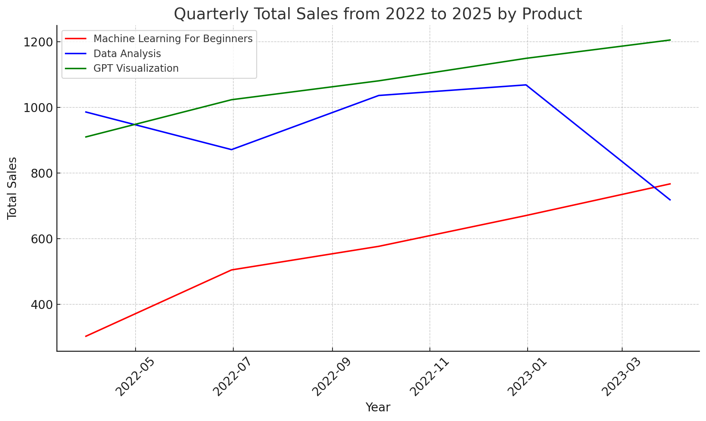

# 花语秘境

## 2025年销售大会

## Sales Analysis

### Machine Learning Rises; GPT Visualization Leads in Sales

1. 从2022年到2023年，“Machine Learning For Beginners”保持稳定增长，显示出逐渐增加的市场需求。

2. “GPT Visualization”在整个期间表现出最高的销售额，表明强劲的持续市场吸引力。
